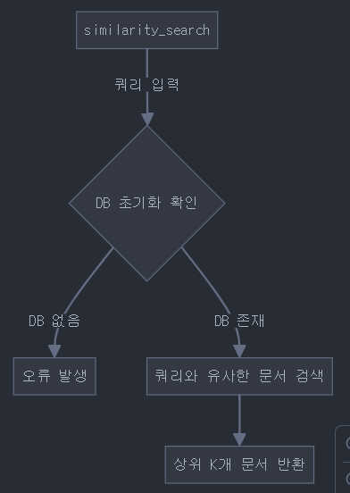
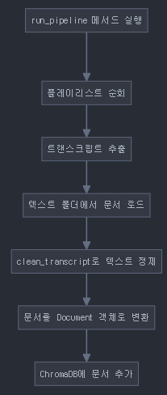
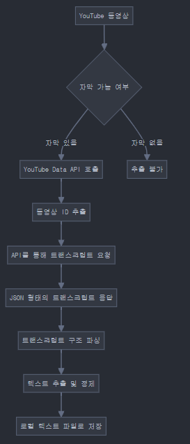
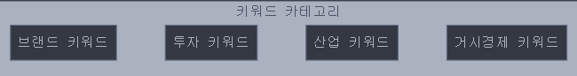
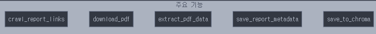
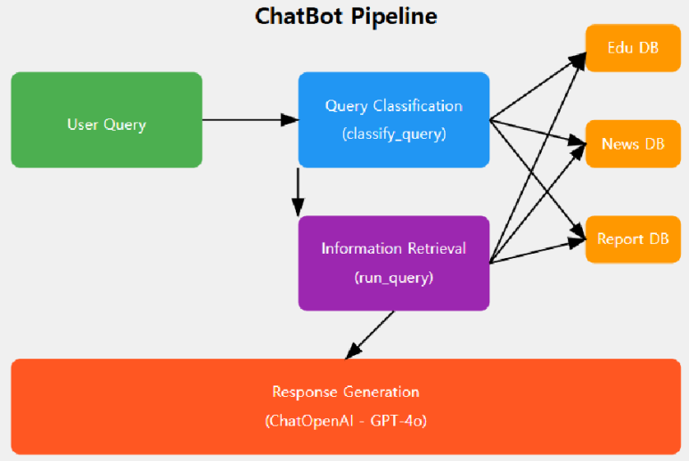
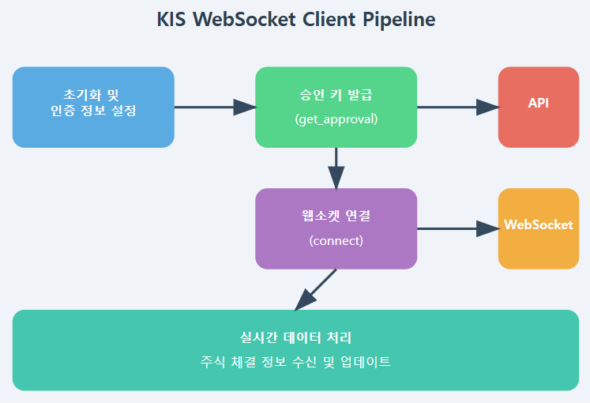

# teensmate-AI

## Use

### Install 
관리자 권한으로 실행 추천
  
1. 가상 환경 설정 및 활성
    ```
    python -m venv venv
    venv/Scripts/activate
    ```
2. 의존성 설치
    ```
    pip install -r requirements.txt
    ```

### Run
1. 프로그램 실행
    ```
    python3 ./src/main.py
    ```

## 소스 코드 설명 (Explain of Source Codes)

### Crawler

####  `ChromaDB.py`



**ChromaDB의 동작 과정 (질문 → 답변)**

1. **사용자가 질문 입력**  
    예: `아이폰을 만드는데 벨류 체인이 뭐야`

2. **질문을 벡터로 변환 (OpenAI 임베딩)**  
    ```python
    embedded_query = OpenAIEmbeddings(질문)
    ```

3. **ChromaDB에서 유사한 문서 검색 (코사인 유사도 비교)**  
    - `embedded_query`와 ChromaDB에 저장된 문서 벡터 비교
    - 코사인 유사도가 높은 문서(가장 관련 있는 문서) 검색

4. **관련 문서 + 질문을 OpenAI로 전달**  
    ```python
    context = "검색된 문서 내용"
    ```
    - OpenAI에게 `context + 사용자 질문`을 전달하고 답변 생성 요청

5. **최종 답변 출력**  
    - OpenAI가 `context + 질문`을 기반으로 답변 생성 후 사용자에게 출력

**효과:** ChromaDB의 코사인 유사도를 활용하여 질문과 관련된 강의(영상) 내용을 빠르게 검색 가능

---

####  `Education.py`




1. YouTube 트랜스크립트 추출
2. 텍스트 정제 및 노이즈 제거
3. ChromaDB를 통한 문서 벡터화 및 저장
4. 교육용 콘텐츠 검색 기능 제공

---

####  `News.py`



1. **키워드 기반 뉴스 분류 및 검색 최적화**  
    - `brand_keywords`, `investment_keywords`, `industry_keywords`, `macro_keywords` 별로 뉴스 저장
    - 특정 주제(예: "반도체", "2차전지")만 검색 가능

2. **장기적인 데이터 분석 가능 (추세 파악)**  
    - 특정 키워드(예: "코스피", "환율")의 변동 추이를 분석하여 경제 흐름 예측
    - 예: "금리 인상" 키워드 등장 빈도 증가 → 시장 변동성 증가 가능성

3. **데이터 기반 AI 금융 서비스 구축 가능**  
    - RAG(Retrieval-Augmented Generation) 기반 챗봇으로 확장 가능
    - AI가 최신 뉴스를 학습해 답변 제공 (예: "지금 반도체 산업 트렌드는?")

---

####  `Report.py`



**삼성증권 리포트 PDF를 크롤링, 다운로드, 텍스트/이미지 추출, 투자 피드백 생성 및 Chroma 벡터 DB 저장까지 수행**

**삼성증권 리포트를 활용하는 이유**  
- 특정 기업에 대한 종합적인 금융 분석 제공
- 투자 판단에 도움을 주는 핵심 데이터 확보 가능

---

### 🧩 `Src` 내부 주요 코드

####  `Chatbot.py`



1. **사용자 쿼리 입력**  
    - 사용자가 경제 관련 질문 입력

2. **쿼리 분류 (`classify_query`)**  
    - 질문 유형 분석
    - 가능한 분류: `edu`, `news`, `report`, `all`, `nothing`

3. **정보 검색 (`run_query`)**  
    - 유형에 따라 해당 데이터베이스 검색
    - 3개 데이터베이스 동시 검색 가능 (`Edu DB`, `News DB`, `Report DB`)

4. **응답 생성**  
    - `ChatOpenAI (GPT-4o)` 모델 사용
    - 청소년을 위한 경제 정보 제공
    - 쉬운 언어로 설명, 필요시 투자 추천 포함

---

####  `draw.py`

**주식 시뮬레이션 및 AI 기반 투자 조언을 제공하는 웹 애플리케이션**

- 주식 거래 시뮬레이션 및 주가 변동 시각화 가능
- AI 챗봇을 통한 투자 관련 조언 제공
- 이미지 기반 분석을 활용한 가치 사슬 분석 기능 포함

---

####  `kis_ws_client.py`



**한국투자증권 API와 WebSocket을 활용하여 실시간 주식 데이터 수신**

**WebSocket을 활용하는 이유**

1. **실시간 데이터 스트리밍**  
    - 주식 가격, 거래량 등은 초 단위로 변화
    - WebSocket을 사용하면 변경된 데이터만 즉시 푸시(push) 가능 → HTTP Polling보다 빠르고 효율적

2. **지속적인 연결 유지 (Persistent Connection)**  
    - WebSocket은 한 번 연결되면 계속 열린 상태를 유지하며 데이터를 주고받을 수 있음
    - 주식 거래는 연속적인 데이터 흐름이 필요하므로, 끊김 없는 지속적 연결이 중요

---

##  마무리

이 프로젝트는 **ChromaDB**, **LangChain**, **OpenAI**, **한국투자증권 API** 등을 활용하여 **경제 교육 및 투자 분석 AI 서비스**를 구축하는 것을 목표로 합니다.